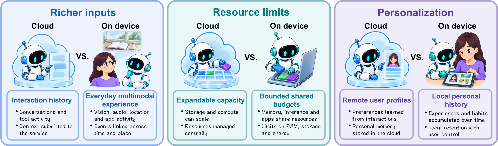
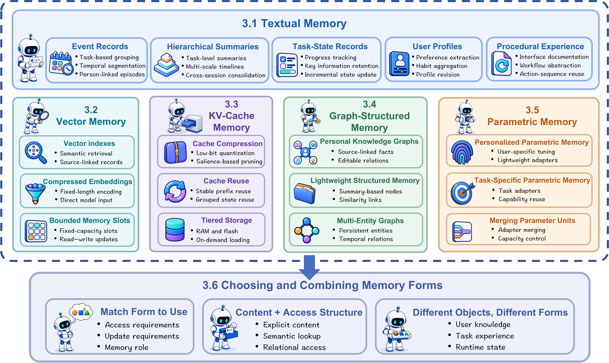

# On-Device Agent Memory: A Survey

👋 Hi, everyone! This is a survey initiated by the team of **Prof. Yuxiang Ren** and maintained by this team. I'm **Wenqi**. 💬 If you have any questions, please don’t hesitate to [contact me](https://github.com/holmeshu)!

⭐ [Star this survey on GitHub](https://github.com/holmeshu/On-Device-Agent-Memory-Survey) and 🤝 join us in building the next-generation on-device agent memory framework.

**🧠 Five memory forms · 🔄 Four lifecycle operations · 📱 Four device contexts**

📖 A curated collection of papers, benchmarks, and deployment evidence accompanying **On-Device Agent Memory: A Survey**. The survey examines how agents retain and use personal experience under device memory, compute, energy, and data-use constraints.

📅 **Resource snapshot:** 2026-10-03 · 📚 **216 distinct cited papers** · 🏆 **32 benchmark entries** · 📱 **41 deployment entries**

⭐ GitHub star badges update automatically. Links point to author repositories or accompanying resources verified on **2026-10-07**.

---

<strong><em>Comparison of typical cloud and personal device deployments of agent memory across inputs, resource budgets, and personalization.</em></strong>

## 📜 Contents

- [📖 Overview](#-overview)
- [📚 Related Surveys](#-related-surveys)
- [🧠 Memory Forms](#-memory-forms)
- [🔄 Lifecycle Management](#-lifecycle-management)
- [👤 Personalization](#-personalization)
- [📱 Device Contexts and Deployment Evidence](#-device-contexts-and-deployment-evidence)
- [🏆 Benchmarks](#-benchmarks)
- [🚀 Open Challenges](#-open-challenges)
- [📃 Citation](#-citation)
- [🤝 Contributing](#-contributing)

## 📖 Overview

Personal devices expose agents to continuous multimodal experience, limited resources, and user-specific histories. Useful memory must preserve relevant information while controlling storage, access, maintenance, and disclosure costs.

The resource follows the survey's organization. Foundational, cloud-based, component-level, and simulated studies are included where relevant. Topic membership does not establish end-to-end on-device execution. Deployment evidence is recorded separately.

| Survey axis | Organizing question | Reading list |
| --- | --- | --- |
| 📐 Foundations | What is retained, for how long, and under which budgets and permissions? | [Definitions and background](docs/foundations.md) |
| 🧠 Memory forms | What basic units represent memory? | [Five forms](docs/memory-forms.md) |
| 🔄 Lifecycle | How is memory formed, retrieved, evolved, and forgotten? | [Lifecycle operations](docs/lifecycle.md) |
| 👤 Personalization | How does history inform user-specific assistance? | [Functions and safeguards](docs/personalization.md) |
| 📱 Deployment | Where do memory components actually run? | [Devices and execution evidence](docs/deployment.md) |
| 🏆 Evaluation | What capabilities and sustained costs are measured? | [Dimensions and benchmarks](docs/evaluation.md) |

## 📚 Related Surveys

- (2024) **A survey on large language model based autonomous agents**. [Paper](https://doi.org/10.1007/s11704-024-40231-1) · 
- (2025) **The rise and potential of large language model based agents: a survey**. [Paper](https://doi.org/10.1007/s11432-024-4222-0) · 
- (2025) **A Survey on the Memory Mechanism of Large Language Model-based Agents**. [Paper](https://doi.org/10.1145/3748302) · 
- (2025) **Memory in the Age of AI Agents**. [Paper](https://arxiv.org/abs/2512.13564) · 
- (2025) **Empowering Edge Intelligence: A Comprehensive Survey on On-Device AI Models**. [Paper](https://doi.org/10.1145/3724420)

## 🧠 Memory Forms

Memory content, access structures, and physical storage play different roles. The survey groups memory by its basic retained units and examines their combinations.

### 📝 Textual Memory

Readable records, summaries, task states, user profiles, and reusable procedures.

- (2026) **FOCAL: Filtered On-device Continuous Activity Logging for Efficient Personal Desktop Summarization**. [Paper](https://arxiv.org/abs/2604.19541) · 
- (2026) **UI-Mem: Self-Evolving Experience Memory for Online Reinforcement Learning in Mobile GUI Agents**. [Paper](https://arxiv.org/abs/2602.05832)
- (2026) **PersonalAlign: Hierarchical Implicit Intent Alignment for Personalized GUI Agent with Long-Term User-Centric Records**. [Paper](https://doi.org/10.18653/v1/2026.acl-long.1669) · 

[📚 All references in this topic](docs/memory-forms.md#textual-memory)

### 🔢 Vector Memory

Embedding-based access through vector indexes, compressed representations, and bounded slots.

- (2025) **MobileRAG: A Fast, Memory-Efficient, and Energy-Efficient Method for On-Device RAG**. [Paper](https://arxiv.org/abs/2507.01079)
- (2026) **MUSE: A Heterogeneity-Aware Multimedia Search Engine for Mobile SoCs**. [Paper](https://arxiv.org/abs/2511.19192)
- (2025) **LEANN: A Low-Storage Vector Index**. [Paper](https://arxiv.org/abs/2506.08276) · 

[📚 All references in this topic](docs/memory-forms.md#vector-memory)

### ⚡ KV-Cache Memory

Transformer key-value states managed through compression, reuse, and tiered storage.

- (2025) **DynaKV: Enabling Accurate and Efficient Long-Sequence LLM Decoding on Smartphones**. [Paper](https://arxiv.org/abs/2511.07427)
- (2026) **Agent-X: Full Pipeline Acceleration of On-device AI Agents**. [Paper](https://arxiv.org/abs/2605.10380)
- (2025) **EfficientNav: Towards on-device object-goal navigation with navigation map caching and retrieval**. [Paper](https://proceedings.neurips.cc/paper_files/paper/2025/hash/067437c6d5d0369b6d09200bef89715b-Abstract-Conference.html) · 

[📚 All references in this topic](docs/memory-forms.md#kv-cache-memory)

### 🕸️ Graph-Structured Memory

Entities, relations, and structured personal or environmental state.

- (2024) **Crafting Personalized Agents through Retrieval-Augmented Generation on Editable Memory Graphs**. [Paper](https://doi.org/10.18653/v1/2024.emnlp-main.281)
- (2025) **Mnemosyne: An unsupervised, human-inspired long-term memory architecture for edge-based LLMs**. [Paper](https://arxiv.org/abs/2510.08601)
- (2026) **EgoGraph: Temporal Knowledge Graph for Egocentric Video Understanding**. [Paper](https://arxiv.org/abs/2602.23709)

[📚 All references in this topic](docs/memory-forms.md#graph-structured-memory)

### 🧬 Parametric Memory

Knowledge and adaptation retained in parameters or modular adapters.

- (2025) **MemLoRA: Distilling Expert Adapters for On-Device Memory Systems**. [Paper](https://arxiv.org/abs/2512.04763)
- (2026) **BitLoRA: Quantization-Compatible Adapter Tuning for 1.58-bit LLM in Federated On-Device AI-Agent**. [Paper](https://doi.org/10.1016/j.eswa.2026.131397)
- (2026) **DuoMem: Towards Capable On-Device Memory Agents via Dual-Space Distillation**. [Paper](https://arxiv.org/abs/2606.29961)

[📚 All references in this topic](docs/memory-forms.md#parametric-memory)

## 🔄 Lifecycle Management

Each operation shares resource budgets and data-use rules with model inference and the other stages of memory management.

### 🗂️ Memory Formation

Decide what enters memory, its granularity, and how provenance is retained.

- (2026) **FOCAL: Filtered On-device Continuous Activity Logging for Efficient Personal Desktop Summarization**. [Paper](https://arxiv.org/abs/2604.19541) · 
- (2025) **EgoTrigger: Toward Audio-Driven Image Capture for Human Memory Enhancement in All-Day Energy-Efficient Smart Glasses**. [Paper](https://arxiv.org/abs/2508.01915) · 
- (2026) **EMBER: Efficient Memory via Budgeted Evidence Retention for Long-Horizon Agents**. [Paper](https://arxiv.org/abs/2606.05894)

[📚 All references in this topic](docs/lifecycle.md#memory-formation)

### 🔍 Memory Retrieval

Choose when to retrieve, which memory to access, and how much evidence to pass to the model.

- (2026) **MemFlow: Intent-Driven Memory Orchestration for Small Language Model Agents**. [Paper](https://arxiv.org/abs/2605.03312)
- (2025) **MobileRAG: A Fast, Memory-Efficient, and Energy-Efficient Method for On-Device RAG**. [Paper](https://arxiv.org/abs/2507.01079)
- (2026) **Agentic Very Long Video Understanding**. [Paper](https://arxiv.org/abs/2601.18157) · 

[📚 All references in this topic](docs/lifecycle.md#memory-retrieval)

### 🌱 Memory Evolution

Consolidate experience and revise retained state as evidence or environments change.

- (2025) **Mnemosyne: An unsupervised, human-inspired long-term memory architecture for edge-based LLMs**. [Paper](https://arxiv.org/abs/2510.08601)
- (2025) **A-Mem: Agentic memory for LLM agents**. [Paper](https://proceedings.neurips.cc/paper_files/paper/2025/hash/19909c36f51abc4856b4560aff3d36d6-Abstract-Conference.html) · 
- (2025) **Beyond Training: Enabling Self-Evolution of Agents with MOBIMEM**. [Paper](https://arxiv.org/abs/2512.15784)

[📚 All references in this topic](docs/lifecycle.md#memory-evolution)

### 🧹 Memory Forgetting

Remove low-value or explicitly targeted information, including influence in derived records or parameters.

- (2026) **MemArchitect: A Policy Driven Memory Governance Layer**. [Paper](https://arxiv.org/abs/2603.18330)
- (2026) **Deployment-Time Memorization in Foundation-Model Agents**. [Paper](https://arxiv.org/abs/2606.10062)
- (2026) **Secure Forgetting: A Framework for Privacy-Driven Unlearning in Large Language Model (LLM)-Based Agents**. [Paper](https://arxiv.org/abs/2604.00430)

[📚 All references in this topic](docs/lifecycle.md#memory-forgetting)

## 👤 Personalization

### 🎯 User Preferences

Learn and update user preferences from explicit feedback and interaction history.

- (2026) **PersonalAlign: Hierarchical Implicit Intent Alignment for Personalized GUI Agent with Long-Term User-Centric Records**. [Paper](https://doi.org/10.18653/v1/2026.acl-long.1669) · 
- (2026) **Learning Personalized Agents from Human Feedback**. [Paper](https://arxiv.org/abs/2602.16173) · 
- (2026) **PERMA: Benchmarking Personalized Memory Agents via Event-Driven Preference and Realistic Task Environments**. [Paper](https://arxiv.org/abs/2603.23231) · 

[📚 All references in this topic](docs/personalization.md#user-preferences)

### 🔗 Personal Reference Resolution

Interpret personal references using remembered people, objects, events, and context.

- (2026) **Embodied Agents Meet Personalization: Investigating Challenges and Solutions Through the Lens of Memory Utilization**. [Paper](https://arxiv.org/abs/2505.16348) · 
- (2026) **EgoSelf: From Memory to Personalized Egocentric Assistant**. [Paper](https://arxiv.org/abs/2604.19564)
- (2026) **SpeechLess: Micro-utterance with Personalized Spatial Memory-aware Assistant in Everyday Augmented Reality**. [Paper](https://doi.org/10.1109/VR67842.2026.00044)

[📚 All references in this topic](docs/personalization.md#personal-reference-resolution)

### 💡 Proactive Assistance

Use history to recognize assistance opportunities while accounting for timing and interruption.

- (2026) **ProAgent: Harnessing On-Demand Sensory Contexts for Proactive LLM Agent Systems in the Wild**. [Paper](https://arxiv.org/abs/2512.06721)
- (2025) **ProMemAssist: Exploring Timely Proactive Assistance Through Working Memory Modeling in Multi-Modal Wearable Devices**. [Paper](https://doi.org/10.1145/3746059.3747770)
- (2026) **Toward Personalized Proactive Agents on Smart Glasses: From Explicit Context Policies to Implicit User Differences**. [Paper](https://doi.org/10.1145/3772363.3798509)

[📚 All references in this topic](docs/personalization.md#proactive-assistance)

### 🔒 Privacy Safeguards

Control retention, access, disclosure, and forgetting throughout personalization.

- (2026) **MemPrivacy: Privacy-Preserving Personalized Memory Management for Edge-Cloud Agents**. [Paper](https://arxiv.org/abs/2605.09530) · 
- (2026) **Agent-Memory Protocol: A privacy-focused protocol for LLM agents and user memory interaction**. [Paper](https://proceedings.mlr.press/v317/wu26a.html)
- (2026) **Opal: Private Memory for Personal AI**. [Paper](https://arxiv.org/abs/2604.02522)

[📚 All references in this topic](docs/personalization.md#privacy-safeguards)

## 📱 Device Contexts and Deployment Evidence

The application device and the execution location of memory components are separate questions. **Full local execution**, **Partial local execution**, **Feasibility only**, and **No local runtime evidence** describe the survey's assessment of runtime evidence.

| Device context | Memory concerns | Detailed evidence |
| --- | --- | --- |
| 💻 Personal computing | Transient GUI state, procedural experience, document indexes | [Phones and computers](docs/deployment.md#personal-computing-systems) |
| 👓 Head-worn systems | Selective sensing, cross-day lifelogs, spatial interaction | [Smart glasses and XR](docs/deployment.md#head-worn-systems) |
| ⌚ Personal sensing | Triggered episodes, procedure progress, longitudinal health records | [Watches and health devices](docs/deployment.md#personal-sensing-systems) |
| 🤖 Embodied systems | Maps, object state, navigation history, skill reuse | [Robots and simulation](docs/deployment.md#embodied-systems) |

[📋 View the complete deployment evidence table](docs/deployment.md#deployment-evidence)

## 🏆 Benchmarks

General benchmarks measure memory capabilities under shared inputs. Device-context benchmarks expose demands arising from personal histories, sensing, or device tasks. A target device does not imply that the complete memory pipeline runs locally.

📏 **Evaluation dimensions:** memory accuracy, lifecycle management, personalization quality, and on-device runtime cost.

[📊 Evaluation reading list and full benchmark comparison](docs/evaluation.md) · [🔎 Code and data release audit](docs/benchmark-availability.md)

📅 **Availability checked: 2026-10-03.** The release audit distinguishes public artifacts, partial releases, planned releases, and unconfirmed access. “Resources not found” records the outcome of this check, not a claim that no release exists.

### 📊 General Agent-Memory Benchmarks

| Benchmark | Scenario | Evaluation focus | Paper | Resources |
| --- | --- | --- | --- | --- |
| LoCoMo | Dialogue | Recall across dialogue sessions | [Paper](https://doi.org/10.18653/v1/2024.acl-long.747) | [Dataset](https://github.com/snap-research/locomo) |
| LongMemEval | Dialogue | Retrieval from dialogue history | [Paper](https://arxiv.org/abs/2410.10813) | [Dataset](https://huggingface.co/datasets/xiaowu0162/longmemeval-cleaned) |
| MemBench | Agent interaction | Factual and reflective memory | [Paper](https://doi.org/10.18653/v1/2025.findings-acl.989) | [Dataset](https://github.com/import-myself/Membench) |
| MemoryAgentBench | Agent interaction | Memory under incremental input | [Paper](https://openreview.net/forum?id=DT7JyQC3MR) | [Dataset](https://huggingface.co/datasets/ai-hyz/MemoryAgentBench) |
| MemoryBench | Agent tasks | Learning from task feedback | [Paper](https://arxiv.org/abs/2510.17281) | [Dataset](https://huggingface.co/datasets/THUIR/MemoryBench) |
| WorldMemArena | Agent interaction | Memory across lifecycle stages | [Paper](https://arxiv.org/abs/2605.29341) | [Dataset](https://huggingface.co/datasets/LCZZZZ/WorldMemArena) |
| Mem2ActBench | Tool use | Tool use with remembered constraints | [Paper](https://doi.org/10.18653/v1/2026.acl-long.370) | [Dataset](https://github.com/Cantaloupe-M/Mem2ActBench) |
| MemoryArena | Agent tasks | Task completion across sessions | [Paper](https://arxiv.org/abs/2602.16313) | [Task setup](https://github.com/ZexueHe/MemoryArena) |
| Memora | Dialogue | Updating outdated personal information | [Paper](https://doi.org/10.18653/v1/2026.findings-acl.1337) | [Dataset](https://github.com/geniesinc/Memora) |
| PM-Bench | Personal assistance | Acting on future intentions | [Paper](https://arxiv.org/abs/2607.12385) | [Dataset](https://github.com/genglinliu/PMBench) |
| LongMemEval-V2 | Web interaction | Recall from agent trajectories | [Paper](https://arxiv.org/abs/2605.12493) | [Dataset](https://huggingface.co/datasets/xiaowu0162/longmemeval-v2) |
| AMA-Bench | Agent tasks | Reasoning over agent trajectories | [Paper](https://arxiv.org/abs/2602.22769) | [Dataset](https://huggingface.co/datasets/AMA-bench/AMA-bench) |
| PA-Bench | Personal assistance | Fact retention after compression | [Paper](https://arxiv.org/abs/2609.05767) | — |
| BudgetBench | Agent tasks | Adherence to context budgets | [Paper](https://arxiv.org/abs/2609.13149) | [Pilot data](https://github.com/aviskaar/budgetbench) |

### 📱 Device-Context Benchmarks

| Benchmark | Scenario | Evaluation focus | Paper | Resources |
| --- | --- | --- | --- | --- |
| MobileMem | Mobile applications | Recall across application histories | [Paper](https://openreview.net/forum?id=w5I11HrMgJ) | [Dataset](https://huggingface.co/datasets/zjunlp/MobileMem) |
| MobileMem-Omni | Mobile applications | Recall across multimodal histories | [Paper](https://arxiv.org/abs/2608.13606) | [Dataset](https://huggingface.co/datasets/zjunlp/MobileMem) |
| MEMARENA | Dialogue | Recall with access control | [Paper](https://arxiv.org/abs/2608.02613) | [Anonymous dataset](https://huggingface.co/datasets/zthsecondantigravity/memarena-l) |
| Memory-QA | Egocentric records | Retrieval of events by time and place | [Paper](https://arxiv.org/abs/2509.18436) | [Dataset](https://github.com/facebookresearch/MemoryQA) |
| S-EMBER | Egocentric records | Retrieval from streaming experience | [Paper](https://arxiv.org/abs/2607.02689) | [Dataset](https://huggingface.co/datasets/facebook/S-EMBER) |
| LifeDialBench | Lifelogging | Recall from continuous dialogue | [Paper](https://doi.org/10.18653/v1/2026.findings-acl.351) | [Dataset](https://github.com/RayNeo-AI-2025/LifeDialBench) |
| MemGUI-Bench | Mobile GUI | Memory use in GUI tasks | [Paper](https://arxiv.org/abs/2602.06075) | [Dataset](https://huggingface.co/datasets/lgy0404/MemGUI-Bench) |
| AndroidWorld-M | Mobile GUI | Task completion using past information | [Paper](https://arxiv.org/abs/2605.29324) | — |
| Memory-World | Mobile GUI | Retention of transient information | [Paper](https://arxiv.org/abs/2605.29324) | — |
| DataScope | Mobile GUI | Tracking information across applications | [Paper](https://arxiv.org/abs/2606.31612) | — |
| AndroidIntent | Mobile GUI | Inference of implicit user intent | [Paper](https://doi.org/10.18653/v1/2026.acl-long.1669) | [Dataset](https://github.com/iLearn-Lab/ACL26-PersonalAlign) |
| MobileIAR | Mobile GUI | Inference of implicit user intent | [Paper](https://arxiv.org/abs/2508.08645) | [Dataset](https://huggingface.co/datasets/wuuuuuz/MobileIAR) |
| PSPA-Bench | Mobile GUI | Planning with user preferences | [Paper](https://arxiv.org/abs/2603.29318) | [Author link](https://anonymous.4open.science/status/PSPA-Bench) |
| DesktopBench | Desktop activity | Summarization of desktop activity | [Paper](https://arxiv.org/abs/2604.19541) | [Dataset](https://huggingface.co/datasets/HaoranYin/desktopbench) |
| HME-QA | Egocentric records | Recall under capture constraints | [Paper](https://arxiv.org/abs/2508.01915) | [Annotations](https://github.com/yahskapar/EgoTrigger) |
| EgoLifeQA | Egocentric records | Recall across days | [Paper](https://arxiv.org/abs/2503.03803) | [Data collection](https://huggingface.co/collections/lmms-lab/egolife) |
| M3-Bench | Video understanding | Reasoning across sensory modalities | [Paper](https://arxiv.org/abs/2508.09736) | [Dataset](https://github.com/bytedance-seed/m3-agent) |
| MEMENTO | Embodied tasks | Task completion using personal knowledge | [Paper](https://arxiv.org/abs/2505.16348) | [Dataset](https://github.com/Connoriginal/MEMENTO) |

## 🚀 Open Challenges

- ⚙️ **[Resource-Aware Lifecycle Management](docs/challenges.md#resource-aware-lifecycle-management)**. Coordinate indexing, retrieval, and maintenance with foreground inference under a shared resource budget.
- 🌱 **[Reliable Memory Evolution](docs/challenges.md#reliable-memory-evolution)**. Preserve evidence and dependencies across revisions so repeated summaries do not become mistaken corroboration.
- 🎯 **[Continual Personalization](docs/challenges.md#continual-personalization)**. Retain uncertainty about changing preferences and distinguish relevance to the current task from lasting preference change.
- 🔒 **[Privacy Protection in Memory Use](docs/challenges.md#privacy-protection-in-memory-use)**. Control disclosure when retained personal history is retrieved and used to answer questions or take actions.
- 🧹 **[Verifiable Forgetting](docs/challenges.md#verifiable-forgetting)**. Trace deletion through derived summaries and retained influence, and define what forgetting checks actually verify.
- ⏱️ **[Long-Term Evaluation on Real Devices](docs/challenges.md#long-term-evaluation-on-real-devices)**. Evaluate sustained interaction and background maintenance with clear component locations and device measurements.

## 📃 Citation

Bibliographic details for the individual resources are available in [references.bib](references.bib). Citation details for **On-Device Agent Memory: A Survey** will be added when its public bibliographic information is available.

## 🤝 Contributing

Suggestions for missing papers, updated links, benchmark releases, and deployment evidence are welcome through GitHub Issues or pull requests. Please include a paper identifier and the survey topic it supports. See [CONTRIBUTING.md](CONTRIBUTING.md).

Paper metadata and topic placement follow the accompanying manuscript and bibliography. The figures reproduce its cloud/device comparison, memory-form, lifecycle, and personalization diagrams.
