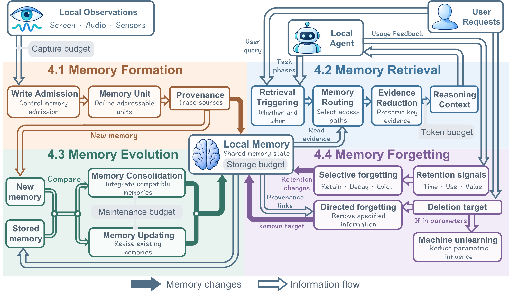

# Lifecycle Management

[Back to the resource page](../README.md) · [All papers](all-papers.md) · [BibTeX](../references.bib)

Formation, retrieval, evolution, and forgetting jointly maintain useful memory over continued interaction. The lists below preserve the manuscript's placement of each reference.

## Contents

- [Memory Formation](#memory-formation)
- [Memory Retrieval](#memory-retrieval)
- [Memory Evolution](#memory-evolution)
- [Memory Forgetting](#memory-forgetting)

## Memory Formation

Decide what enters memory, its granularity, and how provenance is retained.

### Write Admission

- (2022) **SAMoSA: Sensing activities with motion and subsampled audio**. [Paper](https://doi.org/10.1145/3550284)
- (2025) **EgoTrigger: Toward Audio-Driven Image Capture for Human Memory Enhancement in All-Day Energy-Efficient Smart Glasses**. [Paper](https://arxiv.org/abs/2508.01915)
- (2026) **FOCAL: Filtered On-device Continuous Activity Logging for Efficient Personal Desktop Summarization**. [Paper](https://arxiv.org/abs/2604.19541)
- (2026) **STAMP: Training Explicit Memory for Mobile GUI Agents in Controllable and Scalable Virtual Environments**. [Paper](https://arxiv.org/abs/2605.29324)
- (2026) **EMBER: Efficient Memory via Budgeted Evidence Retention for Long-Horizon Agents**. [Paper](https://arxiv.org/abs/2606.05894)
- (2025) **CarMem: Enhancing Long-Term Memory in LLM Voice Assistants through Category-Bounding**. [Paper](https://arxiv.org/abs/2501.09645)
- (2026) **Towards Persistent Case-Based Memory for Autonomous Data Science: A CBR-Augmented R&D-Agent with a Locally Deployable Small Language Model**. [Paper](https://arxiv.org/abs/2606.05250)
- (2026) **Memory-R1: Enhancing Large Language Model Agents to Manage and Utilize Memories via Reinforcement Learning**. [Paper](https://doi.org/10.18653/v1/2026.acl-long.583)
- (2026) **Agentic Memory: Learning Unified Long-Term and Short-Term Memory Management for Large Language Model Agents**. [Paper](https://doi.org/10.18653/v1/2026.acl-long.981)

### Memory Unit

- (2026) **Venus: An Efficient Edge Memory-and-Retrieval System for VLM-based Online Video Understanding**. [Paper](https://arxiv.org/abs/2512.07344)
- (2026) **FOCAL: Filtered On-device Continuous Activity Logging for Efficient Personal Desktop Summarization**. [Paper](https://arxiv.org/abs/2604.19541)
- (2025) **TriPSS: A Tri-Modal Keyframe Extraction Framework Using Perceptual, Structural, and Semantic Representations**. [Paper](https://arxiv.org/abs/2506.05395)
- (2026) **EMBER: Efficient Memory via Budgeted Evidence Retention for Long-Horizon Agents**. [Paper](https://arxiv.org/abs/2606.05894)
- (2026) **UI-Mem: Self-Evolving Experience Memory for Online Reinforcement Learning in Mobile GUI Agents**. [Paper](https://arxiv.org/abs/2602.05832)
- (2026) **MAGNET: Towards Adaptive GUI Agents with Memory-Driven Knowledge Evolution**. [Paper](https://arxiv.org/abs/2601.19199)
- (2026) **Efficient and Effective Personalized In-Context Learning for On-Device Large Model Services**. [Paper](https://doi.org/10.1109/TSC.2026.3697569)

### Provenance

- (2024) **Crafting Personalized Agents through Retrieval-Augmented Generation on Editable Memory Graphs**. [Paper](https://doi.org/10.18653/v1/2024.emnlp-main.281)
- (2026) **FOCAL: Filtered On-device Continuous Activity Logging for Efficient Personal Desktop Summarization**. [Paper](https://arxiv.org/abs/2604.19541)
- (2026) **APEX-MEM: Agentic Semi-Structured Memory with Temporal Reasoning for Long-Term Conversational AI**. [Paper](https://doi.org/10.18653/v1/2026.acl-long.749)
- (2026) **SelfMem: Self-Optimizing Memory for AI Agents**. [Paper](https://arxiv.org/abs/2607.03726)

## Memory Retrieval

Choose when to retrieve, which memory to access, and how much evidence to pass to the model.

### Retrieval Triggering

- (2026) **MemFlow: Intent-Driven Memory Orchestration for Small Language Model Agents**. [Paper](https://arxiv.org/abs/2605.03312)
- (2025) **MobileRAG: A Fast, Memory-Efficient, and Energy-Efficient Method for On-Device RAG**. [Paper](https://arxiv.org/abs/2507.01079)
- (2026) **Agentic Very Long Video Understanding**. [Paper](https://arxiv.org/abs/2601.18157)
- (2026) **UI-Mem: Self-Evolving Experience Memory for Online Reinforcement Learning in Mobile GUI Agents**. [Paper](https://arxiv.org/abs/2602.05832)
- (2025) **Beyond Training: Enabling Self-Evolution of Agents with MOBIMEM**. [Paper](https://arxiv.org/abs/2512.15784)
- (2025) **EfficientNav: Towards on-device object-goal navigation with navigation map caching and retrieval**. [Paper](https://proceedings.neurips.cc/paper_files/paper/2025/hash/067437c6d5d0369b6d09200bef89715b-Abstract-Conference.html)

### Memory Routing

- (2026) **MemFlow: Intent-Driven Memory Orchestration for Small Language Model Agents**. [Paper](https://arxiv.org/abs/2605.03312)
- (2025) **Beyond Training: Enabling Self-Evolution of Agents with MOBIMEM**. [Paper](https://arxiv.org/abs/2512.15784)
- (2026) **Agentic Very Long Video Understanding**. [Paper](https://arxiv.org/abs/2601.18157)
- (2026) **REMem: Reasoning with Episodic Memory in Language Agent**. [Paper](https://arxiv.org/abs/2602.13530)
- (2025) **MobileRAG: A Fast, Memory-Efficient, and Energy-Efficient Method for On-Device RAG**. [Paper](https://arxiv.org/abs/2507.01079)
- (2025) **EfficientNav: Towards on-device object-goal navigation with navigation map caching and retrieval**. [Paper](https://proceedings.neurips.cc/paper_files/paper/2025/hash/067437c6d5d0369b6d09200bef89715b-Abstract-Conference.html)

### Post-Retrieval Evidence Reduction

- (2025) **MobileRAG: A Fast, Memory-Efficient, and Energy-Efficient Method for On-Device RAG**. [Paper](https://arxiv.org/abs/2507.01079)
- (2026) **MemFlow: Intent-Driven Memory Orchestration for Small Language Model Agents**. [Paper](https://arxiv.org/abs/2605.03312)
- (2026) **Lightweight LLM Agent Memory with Small Language Models**. [Paper](https://doi.org/10.18653/v1/2026.acl-long.588)
- (2026) **MemX: A Local-First Long-Term Memory System for AI Assistants**. [Paper](https://arxiv.org/abs/2603.16171)
- (2026) **Clustering-driven Memory Compression for On-device Large Language Models**. [Paper](https://arxiv.org/abs/2601.17443)
- (2025) **MemGuide: Intent-Driven Memory Selection for Goal-Oriented Multi-Session LLM Agents**. [Paper](https://arxiv.org/abs/2505.20231)
- (2026) **Agentic Very Long Video Understanding**. [Paper](https://arxiv.org/abs/2601.18157)
- (2025) **HiAgent: Hierarchical Working Memory Management for Solving Long-Horizon Agent Tasks with Large Language Model**. [Paper](https://doi.org/10.18653/v1/2025.acl-long.1575)

## Memory Evolution

Consolidate experience and revise retained state as evidence or environments change.

### Memory Consolidation

- (2026) **UI-Mem: Self-Evolving Experience Memory for Online Reinforcement Learning in Mobile GUI Agents**. [Paper](https://arxiv.org/abs/2602.05832)
- (2026) **MAGNET: Towards Adaptive GUI Agents with Memory-Driven Knowledge Evolution**. [Paper](https://arxiv.org/abs/2601.19199)
- (2025) **Mnemosyne: An unsupervised, human-inspired long-term memory architecture for edge-based LLMs**. [Paper](https://arxiv.org/abs/2510.08601)
- (2025) **In Prospect and Retrospect: Reflective Memory Management for Long-term Personalized Dialogue Agents**. [Paper](https://doi.org/10.18653/v1/2025.acl-long.413)
- (2025) **A-Mem: Agentic memory for LLM agents**. [Paper](https://proceedings.neurips.cc/paper_files/paper/2025/hash/19909c36f51abc4856b4560aff3d36d6-Abstract-Conference.html)

### Memory Updating

- (2025) **Mem0: Building Production-Ready AI Agents with Scalable Long-Term Memory**. [Paper](https://arxiv.org/abs/2504.19413)
- (2025) **Zep: A Temporal Knowledge Graph Architecture for Agent Memory**. [Paper](https://arxiv.org/abs/2501.13956)
- (2025) **Beyond Training: Enabling Self-Evolution of Agents with MOBIMEM**. [Paper](https://arxiv.org/abs/2512.15784)
- (2026) **ActionEngine: From Reactive to Programmatic GUI Agents via State Machine Memory**. [Paper](https://arxiv.org/abs/2602.20502)
- (2026) **Memory-R1: Enhancing Large Language Model Agents to Manage and Utilize Memories via Reinforcement Learning**. [Paper](https://doi.org/10.18653/v1/2026.acl-long.583)
- (2026) **Agentic Memory: Learning Unified Long-Term and Short-Term Memory Management for Large Language Model Agents**. [Paper](https://doi.org/10.18653/v1/2026.acl-long.981)
- (2026) **LightMem: Lightweight and Efficient Memory-Augmented Generation**. [Paper](https://arxiv.org/abs/2510.18866)
- (2026) **HUOZIIME: An On-Device LLM-enhanced Input Method for Deep Personalization**. [Paper](https://arxiv.org/abs/2604.14159)

## Memory Forgetting

Remove low-value or explicitly targeted information, including influence in derived records or parameters.

### Selective Forgetting

- (2025) **Mnemosyne: An unsupervised, human-inspired long-term memory architecture for edge-based LLMs**. [Paper](https://arxiv.org/abs/2510.08601)
- (2026) **ScrapMem: A Bio-inspired Framework for On-device Personalized Agent Memory via Optical Forgetting**. [Paper](https://arxiv.org/abs/2605.03804)
- (2026) **SuperLocalMemory V3.3: The Living Brain - Biologically-Inspired Forgetting, Cognitive Quantization, and Multi-Channel Retrieval for Zero-LLM Agent Memory Systems**. [Paper](https://arxiv.org/abs/2604.04514)
- (2025) **Memory OS of AI Agent**. [Paper](https://doi.org/10.18653/v1/2025.emnlp-main.1318)
- (2026) **Forget to Improve: On-Device LLM-Agent Continual Learning via Budget-Curated Memory**. [Paper](https://arxiv.org/abs/2606.25115)
- (2026) **When to Forget: A Memory Governance Primitive**. [Paper](https://arxiv.org/abs/2604.12007)
- (2026) **MemArchitect: A Policy Driven Memory Governance Layer**. [Paper](https://arxiv.org/abs/2603.18330)

### Directed Forgetting

- (2026) **Deployment-Time Memorization in Foundation-Model Agents**. [Paper](https://arxiv.org/abs/2606.10062)
- (2026) **Secure Forgetting: A Framework for Privacy-Driven Unlearning in Large Language Model (LLM)-Based Agents**. [Paper](https://arxiv.org/abs/2604.00430)

### Machine Unlearning

- (2024) **Edge Unlearning is Not "on Edge"! An Adaptive Exact Unlearning System on Resource-Constrained Devices**. [Paper](https://arxiv.org/abs/2410.10128)
- (2025) **Towards Memory-Efficient and Sustainable Machine Unlearning on Edge using Zeroth-Order Optimizer**. [Paper](https://doi.org/10.1145/3716368.3735273)
- (2026) **Forget by Uncertainty: Orthogonal Entropy Unlearning for Quantized Neural Networks**. [Paper](https://arxiv.org/abs/2602.00567)
- (2026) **From Anchors to Supervision: Memory-Graph Guided Corpus-Free Unlearning for Large Language Models**. [Paper](https://arxiv.org/abs/2604.13777)
- (2026) **RePAIR: Interactive Machine Unlearning through Prompt-Aware Model Repair**. [Paper](https://arxiv.org/abs/2604.12820)
- (2026) **ZK-APEX: Zero-Knowledge Approximate Personalized Unlearning with Executable Proofs**. [Paper](https://arxiv.org/abs/2512.09953)
