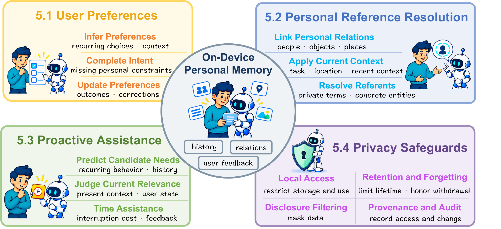

# Personalization

[Back to the resource page](../README.md) · [All papers](all-papers.md) · [BibTeX](../references.bib)

Personal history supports preference learning, personal reference resolution, and proactive assistance. Privacy safeguards govern retention and use across these functions.

## Contents

- [User Preferences](#user-preferences)
- [Personal Reference Resolution](#personal-reference-resolution)
- [Proactive Assistance](#proactive-assistance)
- [Privacy Safeguards](#privacy-safeguards)

## User Preferences

Learn and update user preferences from explicit feedback and interaction history.

- (2003) **Implicit feedback for inferring user preference**. [Paper](https://doi.org/10.1145/959258.959260)
- (2007) **Evaluating the accuracy of implicit feedback from clicks and query reformulations in Web search**. [Paper](https://doi.org/10.1145/1229179.1229181)
- (2026) **Me-Agent: A Personalized Mobile Agent with Two-Level User Habit Learning for Enhanced Interaction**. [Paper](https://arxiv.org/abs/2601.20162)
- (2026) **PersonalAlign: Hierarchical Implicit Intent Alignment for Personalized GUI Agent with Long-Term User-Centric Records**. [Paper](https://doi.org/10.18653/v1/2026.acl-long.1669)
- (2026) **Learning Personalized Agents from Human Feedback**. [Paper](https://arxiv.org/abs/2602.16173)
- (2025) **PerPilot: Personalizing VLM-based Mobile Agents via Memory and Exploration**. [Paper](https://arxiv.org/abs/2508.18040)
- (2026) **MemAura: Structured Context Memory for Personalized LLM Reasoning in Smart Environments**. [Paper](https://doi.org/10.1145/3810196)
- (2025) **UserCentrix: An Agentic Memory-augmented AI Framework for Smart Spaces**. [Paper](https://arxiv.org/abs/2505.00472)
- (2026) **PERMA: Benchmarking Personalized Memory Agents via Event-Driven Preference and Realistic Task Environments**. [Paper](https://arxiv.org/abs/2603.23231)

## Personal Reference Resolution

Interpret personal references using remembered people, objects, events, and context.

- (2025) **PersONAL: Towards a Comprehensive Benchmark for Personalized Embodied Agents**. [Paper](https://arxiv.org/abs/2509.19843)
- (2026) **Embodied Agents Meet Personalization: Investigating Challenges and Solutions Through the Lens of Memory Utilization**. [Paper](https://arxiv.org/abs/2505.16348)
- (2026) **EgoSelf: From Memory to Personalized Egocentric Assistant**. [Paper](https://arxiv.org/abs/2604.19564)
- (2026) **SpeechLess: Micro-utterance with Personalized Spatial Memory-aware Assistant in Everyday Augmented Reality**. [Paper](https://doi.org/10.1109/VR67842.2026.00044)
- (2026) **According to Me: Long-Term Personalized Referential Memory QA**. [Paper](https://arxiv.org/abs/2603.01990)

## Proactive Assistance

Use history to recognize assistance opportunities while accounting for timing and interruption.

- (2026) **PersonalAlign: Hierarchical Implicit Intent Alignment for Personalized GUI Agent with Long-Term User-Centric Records**. [Paper](https://doi.org/10.18653/v1/2026.acl-long.1669)
- (2024) **A Population-to-individual Tuning Framework for Adapting Pretrained LM to On-device User Intent Prediction**. [Paper](https://doi.org/10.1145/3637528.3671984)
- (2025) **ContextAgent: Context-Aware Proactive LLM Agents with Open-World Sensory Perceptions**. [Paper](https://arxiv.org/abs/2505.14668)
- (2026) **ProAgent: Harnessing On-Demand Sensory Contexts for Proactive LLM Agent Systems in the Wild**. [Paper](https://arxiv.org/abs/2512.06721)
- (2026) **H-MAPS: Hierarchical Memory-Augmented Proactive Search Assistant for Scientific Literature**. [Paper](https://doi.org/10.1145/3805712.3808378)
- (2025) **ProMemAssist: Exploring Timely Proactive Assistance Through Working Memory Modeling in Multi-Modal Wearable Devices**. [Paper](https://doi.org/10.1145/3746059.3747770)
- (2026) **Toward Personalized Proactive Agents on Smart Glasses: From Explicit Context Policies to Implicit User Differences**. [Paper](https://doi.org/10.1145/3772363.3798509)

## Privacy Safeguards

Control retention, access, disclosure, and forgetting throughout personalization.

- (2026) **Agent-Memory Protocol: A privacy-focused protocol for LLM agents and user memory interaction**. [Paper](https://proceedings.mlr.press/v317/wu26a.html)
- (2026) **MemPrivacy: Privacy-Preserving Personalized Memory Management for Edge-Cloud Agents**. [Paper](https://arxiv.org/abs/2605.09530)
- (2025) **Big Help or Big Brother? Auditing Tracking, Profiling, and Personalization in Generative AI Assistants**. [Paper](https://www.usenix.org/conference/usenixsecurity25/presentation/vekaria)
- (2026) **MaskClaw: Edge-Side Personalized Privacy Arbitration for GUI Agents with Behavior-Driven Skill Evolution**. [Paper](https://arxiv.org/abs/2605.28646)
- (2026) **SuperLocalMemory: Privacy-Preserving Multi-Agent Memory with Bayesian Trust Defense Against Memory Poisoning**. [Paper](https://arxiv.org/abs/2603.02240)
- (2026) **OpenJarvis: Personal AI, On Personal Devices**. [Paper](https://arxiv.org/abs/2605.17172)
- (2026) **Opal: Private Memory for Personal AI**. [Paper](https://arxiv.org/abs/2604.02522)
- (2025) **Forgetful but Faithful: A Cognitive Memory Architecture and Benchmark for Privacy-Aware Generative Agents**. [Paper](https://arxiv.org/abs/2512.12856)
- (2026) **Secure Forgetting: A Framework for Privacy-Driven Unlearning in Large Language Model (LLM)-Based Agents**. [Paper](https://arxiv.org/abs/2604.00430)
- (2026) **From Anchors to Supervision: Memory-Graph Guided Corpus-Free Unlearning for Large Language Models**. [Paper](https://arxiv.org/abs/2604.13777)
- (2026) **Recovering and Rehosting Mobile Local LLM Conversations and Contexts via Memory Forensics**. [Paper](https://doi.org/10.1109/SP63933.2026.00252)
- (2026) **SuperLocalMemory 4.0: The Governed Memory Operating System for AI Agents**. [Paper](https://arxiv.org/abs/2608.08253)
- (2026) **Mi-Memory: A Lifecycle Memory Framework for Personal AI**. [Paper](https://arxiv.org/abs/2607.18975)
